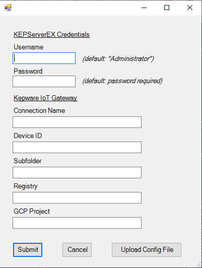
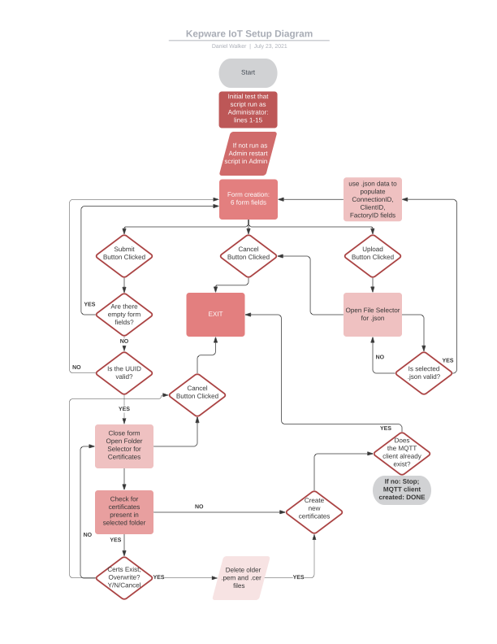

# Usertools GUI for Cloud IoT

This is a simple standalone WinForms GUI to allow an enduser to create an IoT Gateway.
It does the following:
1. Creates an MQTT connection in Kepserver for IoT Gateway
2. Generates x509 Certs for Cloud IoT
3. Creates a Windows Scheduled Task to keep the JWT refresh active every 90 minutes
4. Option to take in JSON file or manually fill in form fields

## Dependencies
1. Powershell 5.1
2. .NET 5.0
3. Run as Admin

## Execution Flow
