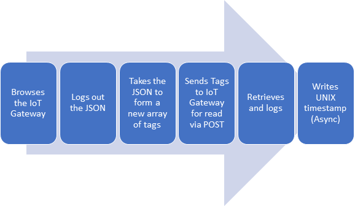
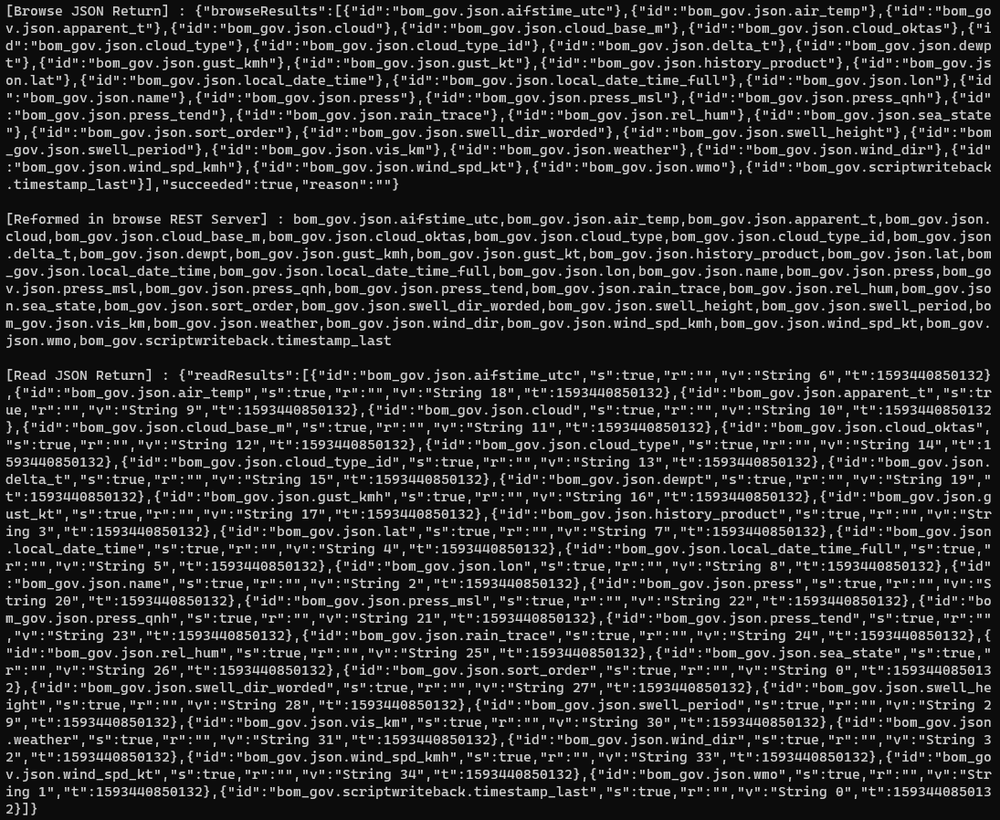
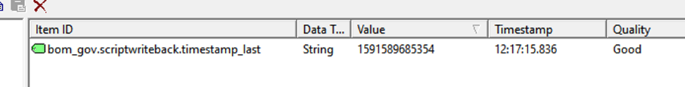

# Generic Read and Write with IoT Gateway REST server Interface

This demo aims to demonstrate the basic, Browse, Read, Write command. The [Kepware_IoTFunction_demo.js](Kepware_IoTFunction_demo.js) uses the HTTP Request to browse the IoT Server on Kepware. After which, we make use of use the data to form an array of tagnames for issuing the HTTP Post back to Kepware for a read operation. Asynchronously, we write a unix timestamp back to Kepware.

**Note:** In the sample, the module [Kepware_iotgateway_functions.js](../Kepware_iotgateway_functions.js) is used for common source codes sharing with other examples. Change the require dir to ```const kepwareIotGateway = require('./Kepware_iotgateway_functions');``` in the script if using the module in the same folder.



## Setup Kepware

1. Load the provided sample file [NodeJsSample.opf](../NodeJsSample.opf)
2. Ensure that [Request HTTP Client](https://github.com/request/request) is installed in the same directory as the [Kepware_iotgateway_functions.js](../Kepware_iotgateway_functions.js) file is located
    - To install, navigate to the folder where the script is located
    - Enter ```npm install request``` to install the required module
3. Navigate to the proper folder and enter ```node ./Kepware_IoTFunction_demo.js``` in command prompt

## Results from IoT Gateway



## Timestamp Writeback

Monitor the value seen below in Quick Client to see the value of the writeback.


