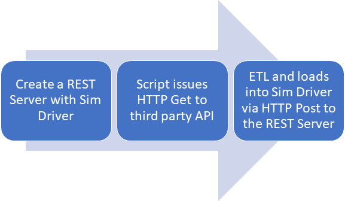
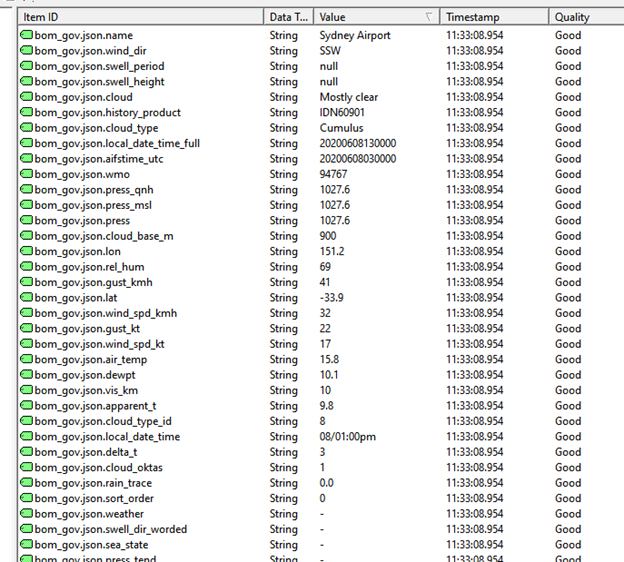

# Write Data from third party API to a Simulation Driver with IoT Gateway REST server Interface

This demo aims to demonstrate pulling data from a third party API, [Australia Weather Information](http://www.bom.gov.au/fwo/IDN60901/IDN60901.94767.json) and store the data into tags within Kepware Server. The [Kepware_IotGW_App.js](Kepware_IotGW_App.js) uses the HTTP Request to pull the data from the third party API, write the data to Kepware Server and continue this process at the defined interval.

**Note:** In the sample, the module [Kepware_iotgateway_functions.js](../Kepware_iotgateway_functions.js) is used for common source codes sharing with other examples. Change the require dir to ```const kepwareIotGateway = require('./Kepware_iotgateway_functions');``` in the script if using the module in the same folder.



## Setup Kepware

1. Load the provided sample file [NodeJsSample.opf](../NodeJsSample.opf)
2. Ensure that [Request HTTP Client](https://github.com/request/request) is installed in the same directory as the [Kepware_iotgateway_functions.js](../Kepware_iotgateway_functions.js) and [Kepware_IotGW_App.js](Kepware_IotGW_App.js) files are located
    - To install, navigate to the folder where the script is located
    - Enter ```npm install request``` to install the required module
3. Navigate to the proper folder and enter ```node ./Kepware_IotGW_App.js``` in command prompt

## Results

Monitor the values seen below in Quick Client to see the value written have been executed.


